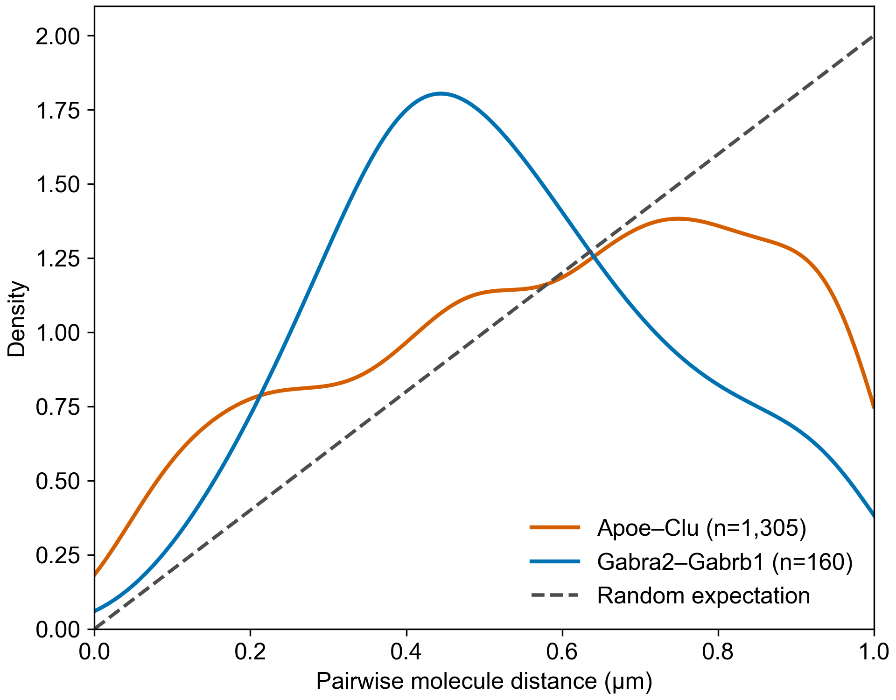
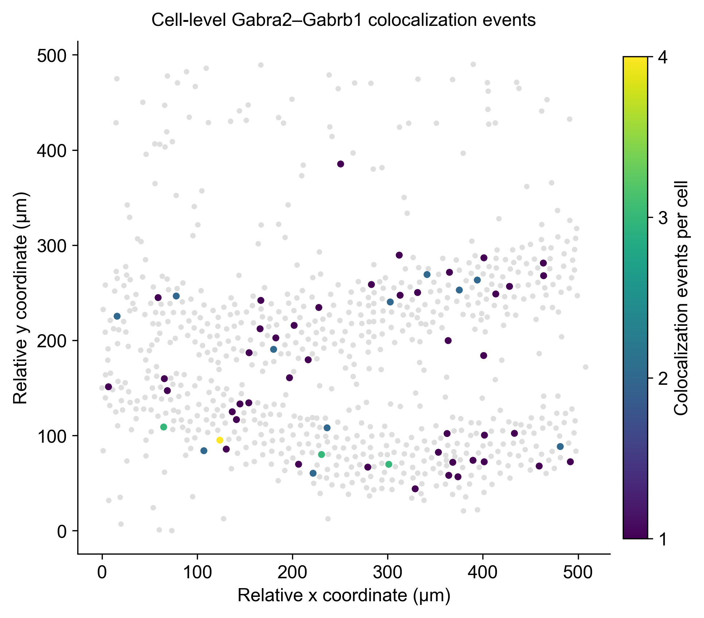

# SCRIN: Subcellular Colocalized RNA Interaction Network

SCRIN is a tool for identifying RNA co-localization networks within subcellular spatial transcriptomics data. While traditional co-localization methods are often bottlenecked by the scale of high-throughput data, SCRIN is engineered for unprecedented speed and memory efficiency, unlocking large-scale spatial transcriptomics analysis that was once computationally prohibitive.

## Quick Start

To run SCRIN with the example dataset:

1. Install SCRIN and its dependencies following [Installation](#installation).
2. Download the example dataset from [Zenodo](https://zenodo.org/records/21486759). The workflow uses `Mouse_brain_CosMx_787cells.csv`.
3. Check that the CSV follows the required [Input Data Format](#input-data-format).
4. Run the command in [Examples](#examples), then inspect the files described in [Expected Output](#expected-output).

## Requirements & Compatibility

The following dependencies are required to run this project.
The versions listed have been tested thoroughly and confirmed to be compatible.

In most cases, other versions also work, as the project relies mainly on stable and widely supported APIs.
If you encounter issues, we recommend reverting to the specified versions.

> **Note**:
> This project has been tested and is currently supported **only on Linux**.
> Support for Windows and macOS may be added in the future, but compatibility is not guaranteed at this time.

**Tested Environment:**

  - Python 3.9
  - Linux

### System Dependencies

  - **MPICH** (== 4.2.1): Required for parallel computing. SCRIN utilizes high-speed parallel processing to efficiently handle large-scale spatial transcriptomics data.

### Python Dependencies

  - mpi4py==3.1.5
  - msgpack==1.1.1
  - numpy==2.0.2
  - pandas==2.3.1
  - pyarrow==21.0.0
  - rtree==1.4.0
  - scikit-learn==1.6.1
  - scipy==1.13.1
  - statsmodels==0.14.5
  - tqdm==4.67.1

## Installation

### Step 1: Set up Python Environment

We recommend using **Anaconda** to manage your environment. Create and activate a new environment:

```bash
conda create -n scrin_env python=3.9
conda activate scrin_env
```

### Step 2: Install MPICH

SCRIN leverages `mpi4py` for high-speed parallel computing to tackle the challenges of large-scale spatial transcriptomics data. This requires a functional MPI (Message Passing Interface) implementation on your system, such as MPICH.

Please install MPICH using one of the following methods before proceeding.

#### Method 1: Install via Conda

The easiest way to ensure compatibility is to let Conda install `mpi4py` and its required MPI implementation (MPICH) together.

```bash
conda install -c conda-forge mpi4py=3.1.5 mpich=4.2.1
```

> **Note on Version Availability**:
> If the command above fails because the specified versions cannot be found for your system, you can try installing without specifying the versions:
>
> ```bash
> conda install -c conda-forge mpi4py mpich
> ```
>
> Please be aware that this will install the latest available packages, which have not been officially tested by us and may lead to unexpected behavior.

#### Method 2: Install via System Package Manager

For Debian-based systems like Ubuntu, you can use `apt`:

```bash
sudo apt update
sudo apt install mpich=4.2.1
```

#### Method 3: Install from Source

For advanced users or specific system configurations, you can compile and install MPICH from the official source. Please refer to the [official MPICH installation guide](https://www.mpich.org/documentation/guides/) for detailed instructions.

### Step 3: Install Python Dependencies

Before installing SCRIN, install the dependencies listed in `requirements.txt`:

```bash
pip install -r requirements.txt
```

> **Note**: If you did not use the Conda method to install MPICH in Step 1, `pip` will attempt to compile `mpi4py` using the system's MPI compiler (`mpicc`). Ensure your MPICH installation is correctly configured in your system's PATH.

### Step 4: Install SCRIN

Once dependencies are installed, SCRIN can be installed in **two ways**:

#### 1. Install from PyPI

```bash
pip install scrin
```

#### 2. Install from local clone

```bash
git clone https://github.com/xryanglab/SCRIN
cd SCRIN
pip install .
```

## Usage

The basic command structure to run SCRIN is as follows:

```bash
mpirun -n <number_of_processes> scrin [OPTIONS]
```

### Input Data Format

SCRIN expects a CSV (Comma-Separated Values) file as input. The file should contain columns for spatial coordinates (x, y, and optionally z), a gene identifier, and a cell identifier. The header names can be arbitrary, as they will be mapped using the ``--column_name`` parameter.

Here are the first few lines of the example file, ``Mouse_brain_CosMx_787cells.csv``:

```csv
x,y,z,gene,cell
-55407.27163461538,1496.6466346153845,-1,Sparcl1,98_241
-55403.90625,1498.0685096153845,0,Ntrk2,98_241
...
```

**Column requirements:**
* **Coordinates (``x``, ``y``, ``z``)**: At least ``x`` and ``y`` columns are required. The ``z`` column is optional. Spatial parameters such as ``--r_check`` and ``--r_dist`` must use the same unit as the coordinates; the example x/y coordinates are in micrometers.
* **Gene ID (``gene`` in the example)**: A column containing the names or identifiers of the RNA species.
* **Cell ID (``cell`` in the example)**: A column indicating which cell each transcript belongs to. This is highly recommended for standard analysis. For data without pre-existing cell segmentation, please refer to the ``Unsegmented Data Options``.

**Note:** Some input files may include extracellular transcripts, often indicated by a cell ID value that does not correspond to a segmented cell. If you plan to use `--background "cooccurrence"`, these transcripts should be removed before running SCRIN. If you use `--background "all"`, keep these transcripts only if you want to include them in the global background statistics; otherwise, remove them before running SCRIN.

### Examples

This workflow uses a spatially contiguous, approximately 500 × 500 µm region containing 787 cells, derived from the [CosMx SMI Mouse Brain FFPE dataset](https://nanostring.com/products/cosmx-spatial-molecular-imager/ffpe-dataset/cosmx-smi-mouse-brain-ffpe-dataset/) by NanoString. The x/y coordinates have been converted from pixels to micrometers, allowing both the main SCRIN analysis and tissue-level downstream visualization.

**Example dataset:** Download the ready-to-run `Mouse_brain_CosMx_787cells.csv` file from [Zenodo](https://zenodo.org/records/21486759).

Compact derived outputs, plotting inputs, scripts, and figures are available in the repository's [787-cell mouse-brain example](examples/mouse_brain_787cells/README.md).

```bash
# Launch SCRIN on 16 parallel processes. Adjust the value of -n as needed.
mpirun -n 16 scrin \
	--detection_method "radius" \
	--background "cooccurrence" \
	--mode "fast" \
	--data_path "Mouse_brain_CosMx_787cells.csv" \
	--save_path "Mouse_brain_CosMx_787cells_hyper_result_cb.csv" \
	--column_name "x,y,z,gene,cell" \
	--r_check 0.5 \
	--z_mode "discrete" \
	--filter_threshold 0.00001 \
	--min_gene_number 5 \
	--min_neighbor_number 1 \
	--expression_level 100 \
	--intermediate_dir "Mouse_brain_CosMx_787cells_hyper_result_cb"
```

**Explanation of parameters:**

* `--detection_method "radius"`: Since CosMx data provides continuous spatial coordinates, we use the `radius` method to define neighbors based on their straight-line distance.
* `--background "cooccurrence"`: The mouse brain is a highly heterogeneous tissue containing many different cell types. Using `cooccurrence` is recommended here, as it calculates the statistical background for a gene pair (A-B) using only the cells where both A and B are expressed. This provides a more specific and relevant context compared to the `all` option (which would be suitable for more homogeneous samples like single cell type). When using this option, remove extracellular transcripts or transcripts not assigned to any cell from the input CSV.
* `--mode "fast"`: We use the `fast` mode to enable high-speed, low-memory parallel processing, which is essential for large datasets. This requires an intermediate directory (`--intermediate_dir`) to store temporary files.
* `--data_path`: Specifies the location of your input raw data. The required CSV structure is described in the [Input Data Format](#input-data-format) section.
* `--save_path`: The file path where the co-localization results will be saved.
* `--column_name`: This parameter maps the input columns (`x`, `y`, `z`, `gene`, and `cell`) to the fields SCRIN expects, as described in the [Input Data Format](#input-data-format) section.
* `--r_check 0.5`: Sets a 0.5 µm search radius because the example x/y coordinates are already expressed in micrometers.
* `--z_mode "discrete"`: Since CosMx data consists of several discrete z-planes that are relatively far apart, we use the `discrete` mode to ensure neighbor searching only occurs within the same imaging plane.
* `--filter_threshold 0.00001`: Sets the q-value cutoff for the final results, ensuring that only statistically significant interactions are reported.
* `--min_gene_number 5`: A pre-filtering step to improve efficiency by excluding sparsely expressed genes (those with fewer than 5 total transcripts in the dataset) from the analysis.
* `--min_neighbor_number 1`: Skips significance testing for gene pairs with zero observed co-localization events, as they cannot be statistically significant.
* `--expression_level 100`: Filters out gene pairs with highly imbalanced expression levels (where one gene's transcript count is over 100 times that of the other) to avoid potential artifacts.
* `--intermediate_dir`: Specifies the directory to store temporary files during parallel processing. This is required when running in `fast` mode to manage memory efficiency across multiple processes.

#### Expected Output

After completion, SCRIN produces two main output files:

* Raw output: `Mouse_brain_CosMx_787cells_hyper_result_cb.csv`
* Final processed output: `Mouse_brain_CosMx_787cells_hyper_result_cb_dedup_1e-05_post_proc.csv`

The final processed output contains significant RNA co-localization pairs after q-value filtering and bidirectional pair deduplication. Key columns include `gene_A`, `gene_B`, `qvalue_BH`, `enrichment_ratio`, and `support_ratio`. See the `Output` section below for the full column descriptions and an example result snippet.

## Command-line Options

### Mode Options

-   **`--detection_method`** `[radius|nine_grid]` (Required): Method for defining neighboring transcripts.
    -   `radius`: Defines neighbors based on the straight-line distance between transcripts. Any transcript within the distance specified by `--r_check` is considered a neighbor. This is suitable for continuous-coordinate data, such as from MERFISH.
    -   `nine_grid`: Defines neighbors as any transcripts located within the same grid square or its eight adjacent squares. This is suitable for array-based data with orderly coordinates, such as from Stereo-seq.

-   **`--background`** `[all|cooccurrence]` (Required): Define the statistical scope used to calculate the parameters for the hypergeometric test.
    -   `all`: All cells in the dataset are used to calculate the background parameters (`n`, `M`, `N`). For each gene, background parameters are computed only once, which enables more consistent comparison of co-localization strength across gene pairs and provides higher computational efficiency. Recommended for homogeneous data (e.g., single cell lines or types) or when using a global background is needed to find weak co-localization signals.
    -   `cooccurrence`: For a given gene pair A-B, only cells where both A and B are present are used to calculate the background parameters. Recommended for heterogeneous data with mixed or highly specific cell types. When using this mode, ensure that transcripts not assigned to any cell (extracellular noise) are removed from your input CSV; see the [Input Data Format](#input-data-format) section.
    -   *Note: The value `k` (observed co-localizations) is calculated the same way in both modes, but the background parameters `n`, `M`, and `N` will differ.*

-   **`--mode`** `[robust|fast]` (Required): The running mode for the program.
    -   `fast`: Designed for large-scale spatial transcriptomics datasets, this mode employs complex asynchronous threading to enable low-memory, high-speed parallel processing, but requires higher network bandwidth for inter-process communication.
    -   `robust`: A more stable running mode but requires higher memory. Can be used for simple tests or if issues are encountered with the `fast` mode.

### Base Parameters

-   **`--data_path`** `[str]` (Required): Path to the input data file. The file must contain transcript spatial coordinates and gene IDs at a minimum. Including cell IDs is recommended. Please refer to the [Input Data Format](#input-data-format) section and `Mouse_brain_CosMx_787cells.csv` for the standard input format.
-   **`--save_path`** `[str]` (Required): Path for saving the results. 
-   **`--column_name`** `[str]` (Required): A comma-separated string specifying which columns from the input file to use. The provided names are mapped sequentially to the expected fields described in the [Input Data Format](#input-data-format) section: `x` (x-coordinate), `y` (y-coordinate), `z` (z-coordinate, optional), `geneID` (gene ID), and `cell` (cell ID, optional). If an optional field like `z` is not present in your data, simply omit it from the string while maintaining the order of the remaining fields. For example, if your file provides columns for x, y, geneID, and cell (but no z), and their names are `pos_x, pos_y, gene_name, cell_label`, your input should be `"pos_x,pos_y,gene_name,cell_label"`. The minimum required fields correspond to `x`, `y`, and `geneID`. Default: `"x,y,z,geneID,cell"`.
-   **`--r_check`** `[float ...]`: One or more search radii for the `'radius'` detection method. Transcripts with a distance less than or equal to a radius are considered neighbors. When multiple values are provided, SCRIN runs the complete analysis once per radius in ascending order. Per-radius result files receive an `_r_<radius>` suffix, and per-radius intermediate files are stored in separate subdirectories under `--intermediate_dir`. A single value preserves the original output paths.
-   **`--z_mode`** `[discrete|continuous]`: Specifies how the vertical dimension (z-axis) is handled during neighbor searching. Default: `discrete`.
    - `discrete`: Neighbors are only searched within the same z-plane. This mode is designed for datasets where z-planes are relatively far apart compared to the search radius, or when co-localization is expected to occur only within the same imaging plane (e.g., **MERFISH** or **CosMx** data). **Note: If your data lacks z-coordinates entirely, you should use this mode.**
    - `continuous`: Uses Euclidean distance across x, y, and z. Use this mode only after confirming that the z coordinates and their scale are appropriate for direct 3D distance calculations; otherwise, use `discrete`.
-   **`--grid_check`** `[int]`: Sets the search window size for the `'nine_grid'` method. It defines a square area of `(2 * grid_check + 1) x (2 * grid_check + 1)` grid cells around a central transcript. For example, `grid_check=1` defines a 3x3 grid (9 cells), while `grid_check=2` defines a 5x5 grid (25 cells). Transcripts within this area are considered neighbors.
-   **`--min_gene_number`** `[int]`: A pre-filtering step to remove sparsely expressed genes. Any gene whose total transcript count across the entire dataset is below this value will be excluded from the analysis. Default: `5`.
-   **`--min_neighbor_number`** `[int]`: Filters out gene pairs with insufficient co-localization events. For a given pair A-B, if the number of times transcripts of gene B are detected as neighbors of transcripts of gene A is below this threshold, that pair will be skipped during the significance calculation. Default: `1`.
-   **`--expression_level`** `[float]`: A filter to exclude gene pairs with highly imbalanced expression. This value sets the maximum allowable fold-difference in total transcript counts between two genes. For example, with the default of `100`, any pair where one gene is over 100 times more abundant than the other will be ignored. Default: `100`.
-   **`--filter_threshold`** `[float]`: The q-value (Benjamini-Hochberg adjusted p-value) threshold for filtering results in post-processing. Default: `0.00001`.
-   **`--pair_keep`** `[first|last]`: Method for deduplicating bidirectional pairs (e.g., A-B and B-A) during post-processing. Pairs are first sorted by their q-value in ascending order. `first` keeps the pair with the smaller q-value, while `last` keeps the one with the larger q-value. Default: `'last'`.

### Intermediate Result Options
For large datasets, use these options to save intermediate results and prevent memory overflow.

-   **`--intermediate_dir`** `[str]`: Directory path to save intermediate results. This parameter is required when using `fast` mode.
-   **`--intermediate_split`** `[int]`: Controls the chunk size for processing. A larger value reduces memory usage but may decrease computational efficiency. It is not recommended to set this value higher than the total number of genes or `1000`, as excessive partitioning can lead to issues. Default: `100`.

### Distribution Options
Options for analyzing the distance distribution of co-localized gene pairs.

-   **`--distribution_analysis`**: A flag to enable the analysis. This will save the distance distribution for each neighboring pair and calculate its statistical features. **Warning:** This can generate very large files and significantly increase runtime. Ensure you have sufficient disk space before enabling.
-   **`--r_dist`** `[float]`: Defines the maximum radius for the distance distribution analysis. For a pair A-B, transcript-pair distances less than or equal to this value are recorded.
-   **`--around_count_threshold`** `[int]`: Minimum number of transcript-pair distances required to calculate distribution-shape statistics for a gene pair. Distances are pooled across cells, and the code uses `shape_count >= around_count_threshold`. Default: `100`.
-   **`--shape_max_distance_count`** `[int]`: Maximum number of distances used to calculate shape descriptors for each pair. When the original `shape_count` exceeds this value, SCRIN uses a reproducible random sample for KDE mode and the other descriptors while retaining the full distance data in the intermediate files. `shape_count` continues to report the original number of distances. Default: `10000`. Users may lower the value for faster analysis or increase it when greater descriptor stability is preferred; the value must be at least `around_count_threshold`.
-   **`--shape_qvalue_threshold`** `[float]`: Only directed pairs with `qvalue_BH` below this threshold are considered for shape calculation, substantially reducing unnecessary KDE calculations. Default: `0.05`, providing broad coverage of potentially relevant pairs. Use a value at least as large as `filter_threshold` when shape descriptors are desired for every final pair.
-   **`--distribution_save_interval`** `[int]`: For the `cooccurrence` background, controls how often worker-side distance data is written to intermediate files. A smaller value reduces worker memory usage but increases file I/O. This parameter is not used by the `all`-background distribution path. Default: `10`.

### Unsegmented Data Options
For data without prior cell segmentation.

-   **`--unsegmented`**: A flag to enable processing of unsegmented data.
-   **`--rect_length`** `[float]`: The side length of the rectangle used to partition the data. The recommended value is the approximate cell diameter. Default: `20`.
-   **`--rtree_path`** `[str]`: Path to an R-tree index file for accelerating spatial queries. If not specified (None), the index is built in memory. If a path is provided but the file doesn't exist, a new index will be built and saved there; if it exists, it will be loaded to accelerate queries.

## Output

SCRIN generates two main types of output files: a raw results file and a post-processed file for downstream analysis.

### Final Processed Output

This is the primary result file you will typically use. It is generated by performing several post-processing steps on the raw output. For the example command, this file would be named `Mouse_brain_CosMx_787cells_hyper_result_cb_dedup_1e-05_post_proc.csv`.

The post-processing includes:
1.  **Adding a `pair` column**: A standardized, sorted identifier for each gene pair (e.g., `GeneA_GeneB`) is added to facilitate deduplication.
2.  **Calculating the Enrichment Ratio**: An enrichment ratio is calculated to prioritize pairs with a higher degree of enrichment.
3.  **Calculating the Support Ratio**: A support ratio is calculated to prioritize pairs with stronger event-level support independent of statistical significance.
4.  **Sorting**: The results are sorted by the Benjamini-Hochberg adjusted q-value (`qvalue_BH`) in ascending order.
5.  **Deduplication**: Bidirectional pairs (e.g., A-B and B-A) are deduplicated based on the `--pair_keep` parameter.
6.  **Filtering**: The results are filtered to keep only the interactions with a `qvalue_BH` below the `--filter_threshold`.

An example snippet from the final output file is shown below:

```
gene_A,gene_B,pvalue,qvalue_BH,qvalue_BO,gene_B_around,gene_B_slice,gene_around,gene_slice,gene_A_N,gene_B_N,pair,enrichment_ratio,support_ratio
Clu,Apoe,3.546414862528735e-170,2.6172541685462066e-167,2.6172541685462066e-167,451,5932,9697,643013,3729,5932,Apoe_Clu,5.04147661674009,0.12094395280235988
...
```

#### Basic Filtering Recommendations

SCRIN's final output contains statistically significant colocalization pairs after directional deduplication and q-value filtering. Whole-transcriptome datasets may still contain many weak but detectable spatial associations, so additional filtering can help prioritize pairs for downstream analysis.

A permissive starting point is:

```text
gene_B_around >= 10
support_ratio >= 0.01
```

These cutoffs are intentionally lenient rather than universal. Thresholds for `gene_B_around`, `support_ratio`, `enrichment_ratio`, `qvalue_BH`, and other relevant metrics can be adjusted according to the dataset, platform, and biological question.

### Raw Output

The program also saves the raw, unfiltered results from the hypergeometric test. Using the example command, this file would be `Mouse_brain_CosMx_787cells_hyper_result_cb.csv`. This file contains all calculated gene pairs before any sorting, deduplication, or q-value filtering, and can be useful for custom analyses or diagnostics.

### Column Descriptions

The columns in the output files correspond to the standard parameters of a hypergeometric test and additional calculated metrics.

| Column           | Description                                                                                             |
|------------------|---------------------------------------------------------------------------------------------------------|
| `gene_A`         | The **central gene** in the pair.                                                                       |
| `gene_B`         | The **target gene** found in the neighborhood of the central gene (`gene_A`).                           |
| `pvalue`         | The raw p-value calculated from the hypergeometric test.                                                |
| `qvalue_BH`      | The p-value adjusted for multiple testing using the Benjamini-Hochberg (BH) method. This is the primary value for assessing significance. |
| `qvalue_BO`      | The p-value adjusted using the more conservative Bonferroni method.                                     |
| `gene_B_around`  | **(k)** The number of observed co-localizations: how many times transcripts of the target gene (`gene_B`) were found in the neighborhood of the central gene (`gene_A`). |
| `gene_B_slice`   | **(M)** The total number of target gene (`gene_B`) transcripts within the defined **statistical background**.     |
| `gene_around`    | **(n)** The total number of all transcripts (from any gene) found in the neighborhood of the central gene (`gene_A`). |
| `gene_slice`     | **(N)** The total number of all transcripts in the defined **statistical background**.              |
| `gene_A_N`       | The total transcript count for the central gene (`gene_A`) in the defined **statistical background**.                   |
| `gene_B_N`       | The total transcript count for the target gene (`gene_B`) in the defined **statistical background**; same as `gene_B_slice`.                    |
| `pair`           | A standardized identifier for the gene pair (e.g., alphabetically sorted), used for post-processing.    |
| `enrichment_ratio`| Neighborhood enrichment relative to the statistical background, calculated as `(gene_B_around / gene_around) / (gene_B_slice / gene_slice)`. It helps prioritize pairs with stronger enrichment. |
| `support_ratio`   | Event-level support normalized by the less abundant transcript count, calculated as `gene_B_around / min(gene_A_N, gene_B_N)`. It provides an intuitive measure of colocalization-event support independent of statistical significance. |

## Downstream Analysis Tools

The following independent commands provide optional downstream analyses and do not rerun or alter the main SCRIN workflow.

### Colocalization Distance-distribution Analysis

Distance-distribution analysis must be enabled during the original SCRIN run because the raw transcript-pair distances are collected during neighborhood detection. It is available for segmented data in `fast`, `radius`, and `discrete` z mode. Add the following options to a standard SCRIN command:

```bash
--distribution_analysis \
--r_dist 1.0 \
--around_count_threshold 100 \
--distribution_save_interval 10
```

`r_check` defines the neighborhood used by the colocalization test, whereas `r_dist` defines the distance range retained for distribution analysis. We recommend setting `r_dist` larger than `r_check` so the distribution also shows distances beyond the colocalization boundary; using the same value truncates that side of the curve and can make its shape difficult to interpret. For the example dataset, `r_check=0.5` µm and `r_dist=1.0` µm. Distance observations are collected within cells and within the same z-plane.

For `--save_path result.csv`, the principal outputs are:

```text
result.csv
result_shape.csv
result_dedup_<filter_threshold>_post_proc_shape.csv
```

`result_shape.csv` contains directed intermediate summaries for pairs that pass `shape_qvalue_threshold` and have at least `around_count_threshold` distances. The final `post_proc_shape` file applies SCRIN's final q-value filtering and undirected pair deduplication, then joins the shape statistics. Significant pairs excluded by the shape q-value or distance-count threshold remain in the final file with missing shape values.

`shape_count` is the number of transcript-pair distance observations pooled across cells for a q-value-eligible pair; shape descriptors additionally require `shape_count >= around_count_threshold`. The other shape columns include KDE-estimated `mode`, `skewness`, excess `kurtosis`, `median`, `q25`, `q75`, and `iqr`, while `skewness_adjusted = 1 / (1 + exp(skewness))` maps skewness to a 0-1 scale. These descriptors provide a quick overview of distribution shape and help screen pairs for closer inspection. The `*_relative` columns report the observed-minus-reference shift after subtracting this geometric background, making the direction of the distribution bias easier to interpret; for example, negative relative quantiles indicate a shift toward shorter distances.

The actual distance lists remain in the retained intermediate directory. Extract one or more undirected pairs without rerunning SCRIN:

```bash
scrin-extract-distances \
	--intermediate_dir "Mouse_brain_CosMx_787cells_hyper_result_cb" \
	--pair "Apoe" "Clu" \
	--pair "Gabra2" "Gabrb1" \
	--min_distance_count 50 \
	--max_distance_count 10000 \
	--random_seed 42 \
	--save_path "selected_pair_distances.parquet"
```

A-B and B-A have the same distance distribution and are treated as one undirected pair. Reversed or repeated inputs are consolidated. For many pairs, use `--pair_path` with a CSV file containing either `gene_A` and `gene_B` columns:

```csv
gene_A,gene_B
Apoe,Clu
Gabra2,Gabrb1
```

The alternative headers `gene_1` and `gene_2` are also accepted. Additional columns are ignored, so a SCRIN result CSV can be supplied directly. Use the file with `--pair_path "pairs.csv"`; `--pair_path` and `--pair` cannot be used together.

`--min_distance_count` discards pairs with fewer observations. When a pair has more than `--max_distance_count`, the command takes a reproducible uniform sample without replacement; pairs within the requested range are exported completely. Defaults are `min_distance_count=1` and no maximum, so extraction is lossless unless sampling is explicitly requested. Sampling can reduce output size and make distribution plotting more manageable.

Output paths ending in `.csv`, `.csv.gz`, and `.parquet` are supported. Parquet is recommended for large outputs. The long-form output contains `gene_1`, `gene_2`, `pair`, and `distance`; `distance` uses the same coordinate unit as the input x/y values. A companion `*_summary.csv` records the original count, exported count, and whether each pair was complete, sampled, below the minimum, or not found.

For an ideal random reference, suppose B transcripts are uniformly distributed in a complete two-dimensional disk of radius (R) around A. Conditional on (0 \le r \le R), the radial distance has:

```text
PDF: f(r) = 2r / R^2
CDF: F(r) = r^2 / R^2
```

The PDF follows from the increasing area of an annulus at radius (r). Overlaying it on empirical KDE curves makes distance preferences easier to see: enrichment or a left shift toward short distances indicates stronger short-range organization, whereas a curve closer to the random reference is more consistent with broader co-compartment localization.

The repository example compares Apoe-Clu and Gabra2-Gabrb1 using the extracted [distance data](examples/mouse_brain_787cells/data/Mouse_brain_CosMx_787cells_selected_pair_distances.parquet) and [plotting script](examples/mouse_brain_787cells/scripts/plot_distance_distributions.py). Gabra2-Gabrb1 shows a stronger short-distance preference, while Apoe-Clu has a broader profile.



### Cell-level Colocalization Events for Tissue Projection

The independent `scrin-colocalization-events` command quantifies selected undirected gene-pair signals at single-cell resolution for projection back onto tissue space. For an undirected pair A-B, every transcript-level A-B connection with a distance less than or equal to `--r_check` contributes one colocalization event. The total number of such connections in each cell provides a direct measure of the local abundance of spatially proximal A-B transcript pairs.

The command recalculates event counts from the original transcript coordinates for only the requested pairs and reports them together with representative cell coordinates. These cell-resolved values can be mapped to colors or other visual encodings in tissue plots without rerunning the main SCRIN significance-testing workflow.

To calculate one pair:

```bash
scrin-colocalization-events \
	--data_path "Mouse_brain_CosMx_787cells.csv" \
	--save_path "Gabra2_Gabrb1_cell_events.csv" \
	--column_name "x,y,z,gene,cell" \
	--pair "Gabra2" "Gabrb1" \
	--r_check 0.5 \
	--z_mode "discrete" \
	--n_jobs 8
```

For multiple pairs, supply `--pair_path` instead of `--pair`. The pair file must contain `gene_A` and `gene_B` columns. A SCRIN result CSV can be used directly because additional columns are ignored. Bidirectional and repeated pairs are consolidated, while self-pairs such as A-A are not supported.

The output contains one row per cell and requested pair, including cells with zero events:

```csv
cell,cell_x,cell_y,gene_A,gene_B,r_check,gene_A_count,gene_B_count,colocalization_count
99_211,-55310.9375,1292.1442307692307,Gabra2,Gabrb1,0.5,9,8,1
```

`cell_x` and `cell_y` are the coordinate-wise medians of all transcripts in the cell, including genes outside the requested pairs. For tissue projection, the input transcript x/y values must be global tissue coordinates. If the input uses coordinates local to each cell or field, these medians will not represent the cells' positions in the full tissue. `gene_A_count` and `gene_B_count` are the corresponding transcript counts in that cell. Duplicate transcript rows are retained as separate molecules. With `--z_mode discrete`, only transcripts in the same z-plane can form an event; with `--z_mode continuous`, three-dimensional Euclidean distance is used.

Use `cell` to link the result to cell metadata or segmentation boundaries, and use `cell_x`, `cell_y`, and `colocalization_count` to draw a point-based tissue map or to color cell regions by event count. Such projections can reveal where an undirected colocalization pair is concentrated across the tissue, including spatial gradients, regional enrichment, or localized hotspots.

The provided [Gabra2-Gabrb1 event table](examples/mouse_brain_787cells/data/Mouse_brain_CosMx_787cells_Gabra2_Gabrb1_cell_events.csv) and [plotting script](examples/mouse_brain_787cells/scripts/plot_cell_colocalization_map.py) produce the map below.



`--n_jobs` controls local multiprocessing and defaults to `1`. Increase it to process cells in parallel.

### Empirical False-positive Baseline Analysis

Platform-provided negative-control features can be used to examine whether control-associated background contributes to SCRIN-detected colocalization pairs. The GitHub example dataset contains ten negative-control probes named `NegPrb1` through `NegPrb10`. Analyze them with:

```bash
scrin-false-positive-analysis \
	--result_path "Mouse_brain_CosMx_787cells_hyper_result_cb.csv" \
	--control_group "negative_control_probe" "prefix" "NegPrb"
```

This command requires the raw SCRIN result rather than a threshold-filtered `post_proc` file. It reproduces SCRIN's bidirectional pair deduplication and then reports results at `qvalue_BH < 0.05`, `0.01`, `0.001`, and `1e-5` by default. Use `--qvalue_thresholds` to supply other cutoffs and `--pair_keep` when the original analysis used a non-default deduplication setting.

A pair is control-associated when either `gene_A` or `gene_B` matches a control rule. The reported control-associated pair fraction is:

```text
number of significant control-associated pairs / total number of significant pairs
```

The fraction is an empirical diagnostic, not a direct estimate of the statistical false-positive rate or BH false discovery rate. It reflects only the background represented by the supplied control features and may depend on panel composition, control-feature abundance, and the number of control features.

Control rules use the form `GROUP_NAME MATCH_MODE PATTERN`. Supported match modes are `exact`, `prefix`, `suffix`, and `contains`; add `--ignore_case` for case-insensitive matching. Repeat `--control_group` to define multiple rules or groups. Each group is reported separately, and an `any_control` union is also reported when multiple groups are present.

Results are printed to the terminal. Use `--save_path` to additionally save the small summary table as CSV.

### Multi-radius Analysis of Colocalization Scale

The neighborhood radius defines the spatial scale at which SCRIN evaluates transcript proximity. Smaller radii, approximately 0.2-0.5 µm, are useful starting points for highly local RNA organization, whereas larger radii, approximately 1-2 µm, can capture broader subcellular domains or compartment-level organization. These ranges are not universal: radius selection should reflect the biological question, the platform's spatial resolution, and the coordinate units of the input data.

With the `radius` detection method, provide multiple values after `--r_check` to run the complete SCRIN workflow at each radius. Because the example coordinates are in micrometers, the desired radii can be supplied directly:

```bash
--detection_method "radius" \
--r_check 0.25 0.5 0.75 1.0 1.5 2.0
```

For `--save_path result.csv`, SCRIN creates radius-specific raw files such as `result_r_0p25.csv` and final files such as `result_r_0p25_dedup_1e-05_post_proc.csv`. Decimal points are represented by `p` in radius suffixes. When `--intermediate_dir` is supplied, each radius also receives a separate `r_<radius>` subdirectory using the same suffix format.

To examine radius-dependent significance, take the union of pairs significant at any radius, retrieve their `qvalue_BH` values from the raw result at every radius, and plot a pair-by-radius heatmap of `-log10(qvalue_BH)`. The heatmap reveals persistent, short-range, and broader-scale colocalization patterns across pairs.

## Citation

If you use SCRIN in your research, please cite our publication.

## For any questions, please contact:

Xuerui Yang (yangxuerui@tsinghua.edu.cn); Xu Chen (chenxu22@mails.tsinghua.edu.cn)


